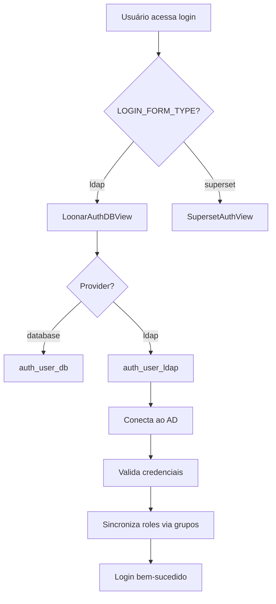

# Status da Configuração LDAP/Active Directory

**Data da Análise:** 14 de Janeiro de 2026  
**Ambiente:** Produção (finops.sondahybrid.com)

## ✅ CORREÇÕES APLICADAS

### 1. ✅ `superset_config.py` - AUTH_TYPE Corrigido

**Antes:**
```python
from flask_appbuilder.security.manager import AUTH_DB
# ...
AUTH_TYPE = AUTH_DB  # ❌ Sempre banco de dados
```

**Depois:**
```python
from flask_appbuilder.security.manager import AUTH_DB, AUTH_LDAP
# ...
AUTH_TYPE = AUTH_LDAP if _LOGIN_FORM_TYPE == "ldap" else AUTH_DB  # ✅ Dinâmico
```

### 2. ✅ `.env-prod` - Login Form Atualizado

**Antes:**
```bash
SUPERSET_LOGIN_FORM_TYPE=superset  # ❌ Formulário padrão
```

**Depois:**
```bash
SUPERSET_LOGIN_FORM_TYPE=ldap  # ✅ Formulário LDAP customizado
```

---

## 📋 RESUMO DA ARQUITETURA LDAP

### Componentes Implementados

| Componente | Status | Descrição |
|------------|--------|-----------|
| `ldap_config.py` | ✅ OK | Gerencia configurações LDAP (real/mock) |
| `security.py` | ✅ OK | SecurityManager customizado com LDAP |
| `LoonarAuthDBView` | ✅ OK | View de login híbrida (DB + LDAP) |
| `LoonarSecurityManager` | ✅ OK | Sincronização de roles via grupos LDAP |
| Variáveis `.env-prod` | ✅ OK | Todas as configs LDAP presentes |
| `AUTH_TYPE` | ✅ CORRIGIDO | Agora usa AUTH_LDAP |
| Template customizado | ✅ OK | `loonar/security/login.html` |

### Fluxo de Autenticação



---

## 🔐 CONFIGURAÇÕES LDAP ATIVAS

### Servidor Active Directory

```bash
LOONAR_LDAP_MODE=real
LOONAR_LDAP_SERVER_REAL=ldap://172.16.104.141:389
LOONAR_LDAP_BIND_DN_REAL=CN=Morpheus Serviços,OU=BR-BH,OU=03-SERVICOS,DC=sondadc,DC=local
```

### Base DNs

```bash
# Usuários
LOONAR_LDAP_USER_BASE_REAL=OU=04-CLIENTES,DC=sondadc,DC=local

# Grupos (para sincronização de roles)
LOONAR_LDAP_GROUP_BASE_REAL=OU=04-CLIENTES,DC=sondadc,DC=local
```

### Mapeamento de Atributos

```bash
LOONAR_LDAP_UID_ATTR=sAMAccountName        # Login (ex: joao.silva)
LOONAR_LDAP_FIRSTNAME_ATTR=givenName       # Primeiro nome
LOONAR_LDAP_LASTNAME_ATTR=sn               # Sobrenome
LOONAR_LDAP_EMAIL_ATTR=mail                # Email
```

---

## 🚀 PRÓXIMOS PASSOS PARA DEPLOY

### 1. No Servidor Remoto (finops.sondahybrid.com)

```bash
# 1. Parar os containers
cd /path/to/superset
docker-compose -f docker-compose-loonar.yml down

# 2. Atualizar arquivos (via git ou scp)
# - loonar/.env-prod
# - loonar/pythonpath/superset_config.py

# 3. Reconstruir imagem (se necessário)
docker-compose -f docker-compose-loonar.yml build superset_app

# 4. Iniciar containers
docker-compose -f docker-compose-loonar.yml up -d

# 5. Verificar logs
docker-compose -f docker-compose-loonar.yml logs -f superset_app | grep -i ldap
```

### 2. Validar Configuração LDAP

```bash
# Verificar se AUTH_TYPE está correto
docker-compose -f docker-compose-loonar.yml exec superset_app \
  python -c "from superset_config import AUTH_TYPE; print(f'AUTH_TYPE: {AUTH_TYPE}')"

# Deve imprimir: AUTH_TYPE: 3 (AUTH_LDAP)
```

### 3. Testar Autenticação

1. **Acesse:** https://finops.sondahybrid.com
2. **Verifique:** Formulário de login customizado com opção "Active Directory"
3. **Teste:** Login com usuário AD (ex: `joao.silva` + senha AD)
4. **Confirme:** Sincronização de roles baseada em grupos LDAP

---

## 🛡️ RECURSOS DE SEGURANÇA

### Autenticação Híbrida

O sistema suporta **dois métodos de autenticação simultâneos**:

1. **Banco de Dados:** Usuários locais do Superset (admin)
2. **Active Directory:** Usuários corporativos via LDAP

### Sincronização Automática de Roles

Quando um usuário faz login via LDAP:
1. Sistema busca grupos AD do usuário
2. Mapeia grupos AD para roles do Superset (mesmo nome)
3. Sincroniza permissões automaticamente

**Exemplo:**
- Usuário está no grupo AD: `Superset_Admins`
- Sistema atribui role: `Superset_Admins` no Superset

---

## ⚠️ PONTOS DE ATENÇÃO

### Conectividade de Rede

- ✅ Servidor precisa acessar `172.16.104.141:389` (LDAP)
- ✅ Firewall deve permitir tráfego na porta 389
- ✅ DNS deve resolver `sondadc.local`

### Credenciais de Bind

```bash
# Valide as credenciais manualmente
ldapsearch -x -H ldap://172.16.104.141:389 \
  -D "CN=Morpheus Serviços,OU=BR-BH,OU=03-SERVICOS,DC=sondadc,DC=local" \
  -w "WzcJsuSa94yIJvzO" \
  -b "OU=04-CLIENTES,DC=sondadc,DC=local" \
  "(objectClass=person)" sAMAccountName
```

### Logs de Debug

Para habilitar logs detalhados de LDAP:

```python
# Em superset_config.py
LOG_LEVEL = "DEBUG"  # Temporariamente para diagnóstico
```

---

## 📚 DOCUMENTAÇÃO RELACIONADA

- [AUTHENTICATION_FIX.md](../loonar/AUTHENTICATION_FIX.md) - Correções de autenticação
- [README-DEPLOY.md](../loonar/README-DEPLOY.md) - Guia de deploy
- [.env-prod](../loonar/.env-prod) - Variáveis de ambiente

---

## ✅ CHECKLIST DE VALIDAÇÃO

- [x] AUTH_LDAP importado em `superset_config.py`
- [x] AUTH_TYPE configurado dinamicamente
- [x] SUPERSET_LOGIN_FORM_TYPE definido como `ldap`
- [x] Todas as variáveis LDAP presentes no `.env-prod`
- [x] `LoonarSecurityManager` implementado
- [x] `LoonarAuthDBView` com login híbrido
- [x] Template customizado configurado
- [ ] **PENDENTE:** Deploy no servidor remoto
- [ ] **PENDENTE:** Teste de autenticação AD em produção
- [ ] **PENDENTE:** Validação de sincronização de roles

---

**Status Final:** ✅ **Configuração LDAP Completa e Pronta para Deploy**

Todas as correções foram aplicadas. O sistema está configurado para autenticação via Active Directory.
