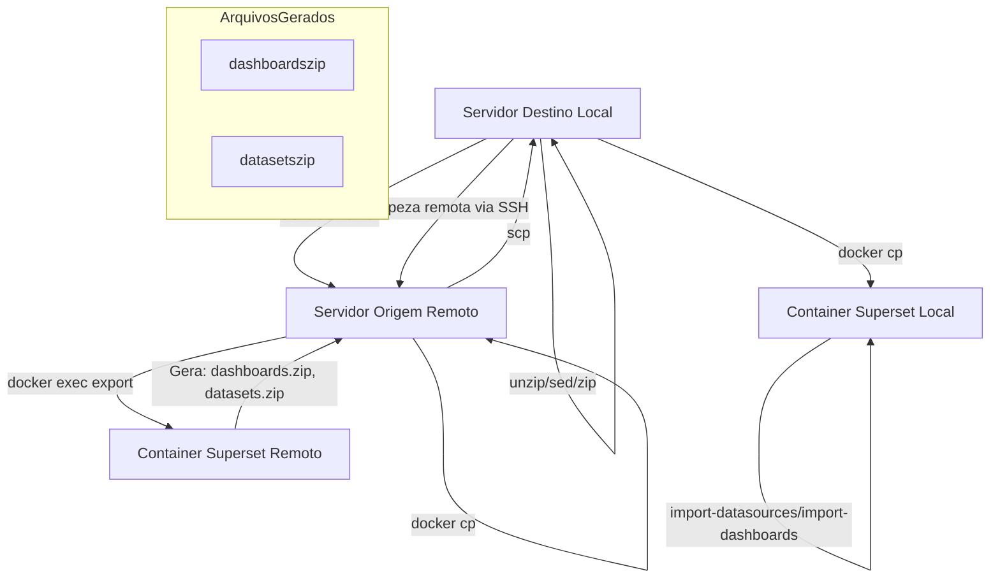

# Documentação: import-dashboards.sh

## Propósito

O script `import-dashboards.sh` automatiza a exportação, transferência, ajuste e importação de dashboards e datasets do Apache Superset entre ambientes (servidores), facilitando a migração e atualização de artefatos entre instâncias Superset via SSH e Docker.

## Requisitos

- **Conectividade SSH**: É necessário que o servidor de destino consiga acessar o servidor de origem via SSH, utilizando uma chave SSH previamente autorizada (sem senha).
- **Docker**: Ambos os servidores (origem e destino) devem possuir Docker instalado e o container do Superset em execução.
- **Comandos necessários**: `ssh`, `scp`, `docker`, `unzip`, `zip`, `find`, `sed` devem estar disponíveis no ambiente local.

## Diagrama de Processo



- **dashboards.zip**: Exportação dos dashboards do Superset
- **datasets.zip**: Exportação dos datasets/conexões do Superset (modificado localmente para injetar URI e renomear conexão)

## Parâmetros de Execução Interativa

Durante a execução padrão (interativa), o script solicitará confirmação e permitirá editar os seguintes parâmetros:

- Usuário SSH do servidor de origem
- Host/IP do servidor de origem
- Diretório local para salvar imports
- Diretório temporário remoto para exports
- Nome do container Superset (local e remoto)
- SQLAlchemy URI local (com senha)

## Parâmetros para Execução por Linha de Comando (Modo CI)

Para execução não-interativa (ex: CI/CD), utilize os parâmetros abaixo:

```
./import-dashboards.sh \
  --user USUARIO \
  --host HOST \
  --imports-dir DIR \
  --exports-tmp-dir DIR \
  --container NOME \
  --sql-uri URI \
  --no-prompt
```

- `--user`           : Usuário SSH do servidor de origem
- `--host`           : Host/IP do servidor de origem
- `--imports-dir`    : Diretório local para salvar imports
- `--exports-tmp-dir`: Diretório temporário remoto para exports
- `--container`      : Nome do container Superset
- `--sql-uri`        : SQLAlchemy URI local (com senha)
- `--no-prompt`      : Executa em modo não-interativo (CI)

## Valores Padrão Substituíveis

- `ORIG_SSH_USER`         : devopsvanilla
- `ORIG_SSH_HOST`         : 192.168.0.222
- `CONTAINER_NAME`        : superset_app
- `HOST_IMPORTS_DIR`      : ./imports
- `CONTAINER_IMPORTS_DIR` : /tmp/local_superset_imports
- `EXPORTS_TMP_DIR`       : /tmp/superset_exports
- `SUPERSET_SQL_URI`      : postgresql+psycopg2://superset:XXXXXXXXX@db:5432/superset

Todos podem ser sobrescritos via linha de comando ou durante a execução interativa.

## Problemas Comuns

- **Falha de conexão SSH**: Verifique se a chave SSH está autorizada e o host está acessível.
- **Container não encontrado**: Confirme o nome do container e se está em execução.
- **Permissões de arquivo**: Certifique-se de que o usuário tem permissão para ler/escrever nos diretórios especificados.
- **Comandos ausentes**: Instale todos os utilitários requeridos (`ssh`, `scp`, `docker`, etc).
- **Conflito de conexão**: O script renomeia a conexão para `PostgreSQL_Import` para evitar conflitos, mas revise após importação.

## Segurança

- **Senhas em URI**: A senha do banco de dados é injetada no arquivo YAML durante o processo. Evite expor logs ou arquivos temporários.
- **Chave SSH**: Use chaves SSH protegidas por senha e restrinja o acesso ao servidor de origem.
- **Limpeza**: O script oferece opção de limpar arquivos temporários remotos ao final do processo.
- **Usuário admin**: A importação é feita com o usuário `admin` do Superset local. Certifique-se de que as credenciais estejam seguras.

---

> **Dica:** Sempre revise os arquivos importados e as conexões criadas após o processo para garantir que não há dados sensíveis ou configurações indesejadas.
